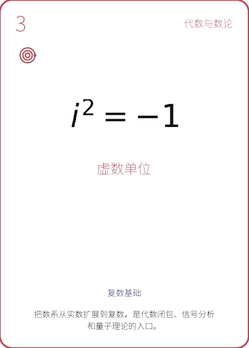
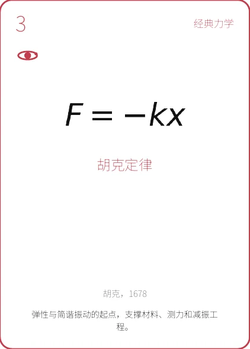
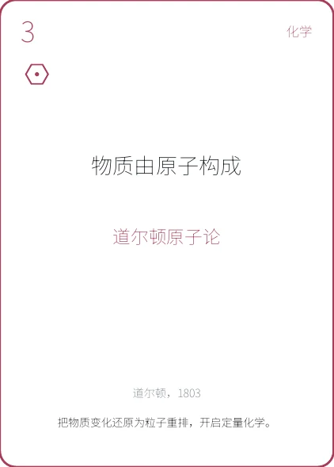
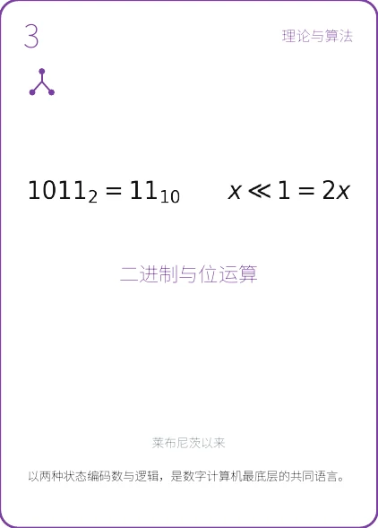

# 科学文明扑克 · Science Poker

<p align="center">
  <strong>把改变世界的科学思想，握在手中。</strong><br />
  <em>Hold the ideas that changed the world in your hands.</em>
</p>

<p align="center">
  <a href="#中文">中文</a> · <a href="#english">English</a> ·
  <a href="https://github.com/liusiyuan586-hue/Science-poker">GitHub</a> ·
  <a href="https://liusiyuan586-hue.github.io/Science-poker/">在线体验 / Live Demo</a>
</p>

<p align="center">
  
  
  
  
</p>

---

## 中文

### 项目简介

**科学文明扑克**是一个互动式科学知识卡牌网站。项目将数学、物理、自然科学和计算机科学四大学科整理为 **216 张知识卡牌**，以扑克牌的形式呈现重要公式、理论、人物与科学发现。

用户可以从四套牌组进入知识世界，浏览每一张卡牌，并进一步阅读其核心原理、历史背景、现实应用、研究图像和参考来源。项目希望把科学教育、视觉设计与收藏体验结合起来，让严肃知识变得直观、好看、易于探索。

### 网页内容

- **四大学科牌组**：数学、物理、自然科学、计算机科学，每组 54 张卡牌。
- **知识卡牌浏览**：按照学科与花色组织内容，用颜色区分不同知识分支。
- **卡牌详情页**：展示公式、核心命题、影响、历史脉络、应用场景与延伸资料。
- **研究内容呈现**：支持科学插图、资料来源、视频链接与可搜索的长文本内容。
- **交互与动效**：卡牌翻转、飞行动画、响应式布局与减少动态效果的无障碍适配。

### 技术实现路线

```text
结构化科学资料（JSON / 研究素材）
                ↓
Python 内容整理与卡牌生成工具
                ↓
React + TypeScript 交互界面
                ↓
KaTeX 公式渲染 + CSS 动效与响应式设计
                ↓
Vinext / Vite 构建 → Cloudflare Workers / Sites 部署
```

项目使用 **React 19、TypeScript、Next.js 兼容组件模型与 Vinext** 构建交互界面；使用 **KaTeX** 渲染数学公式，以 JSON 管理卡牌及研究内容，并通过 Python 工具完成资料整理、牌组生成和文档导出。最终由 Vite 与 Cloudflare 插件构建为适合 Workers / Sites 环境运行的应用。

### 本地运行

需要 Node.js `>= 22.13.0`。

```bash
npm install
npm run dev
```

构建与检查：

```bash
npm run build
npm run build:pages
npm test
```

推送到 `main` 分支后，仓库中的 GitHub Actions 工作流会自动构建并发布 GitHub Pages。

> [!IMPORTANT]
> 本项目内容仅供学习与交流。知识卡牌可能存在疏漏或错误，请结合教材、论文和权威机构资料独立核验。

---

## English

### About

**Science Poker** is an interactive educational website that turns mathematics, physics, natural science, and computer science into a collection of **216 knowledge cards**. Important formulas, theories, scientists, and discoveries are presented through the familiar visual language of playing cards.

Visitors can enter one of four subject decks, browse individual cards, and explore each topic's key idea, historical context, real-world applications, research imagery, and references. The project brings together science education, visual design, and the pleasure of collecting to make serious knowledge engaging and approachable.

### What the Website Includes

- **Four subject decks:** Mathematics, Physics, Natural Science, and Computer Science, with 54 cards in each deck.
- **Card-based exploration:** Topics are organized by subject and suit, with a distinct color system for each branch.
- **Detailed card pages:** Formulas, central ideas, impact, historical context, applications, and further reading.
- **Research-rich content:** Scientific illustrations, source links, video references, and searchable long-form text.
- **Thoughtful interaction:** Card-flight transitions, responsive layouts, and reduced-motion accessibility support.

### Technical Approach

```text
Structured science data (JSON / research assets)
                ↓
Python content and deck-generation tools
                ↓
React + TypeScript interactive interface
                ↓
KaTeX formula rendering + responsive CSS motion
                ↓
Vinext / Vite build → Cloudflare Workers / Sites deployment
```

The interface is built with **React 19, TypeScript, a Next.js-compatible component model, and Vinext**. **KaTeX** renders mathematical notation, JSON files hold the card and research data, and Python utilities support content preparation, deck generation, and document exports. Vite and the Cloudflare plugin produce a Workers / Sites-compatible application.

### Run Locally

Node.js `>= 22.13.0` is required.

```bash
npm install
npm run dev
```

Build and verify:

```bash
npm run build
npm run build:pages
npm test
```

After changes are pushed to the `main` branch, the included GitHub Actions workflow automatically builds and deploys the GitHub Pages site.

> [!IMPORTANT]
> This project is intended for learning and discussion. Knowledge cards may contain omissions or errors; please verify important information against textbooks, research papers, and authoritative sources.

---

<p align="center">Science in your hands · 科学，就在手中</p>
